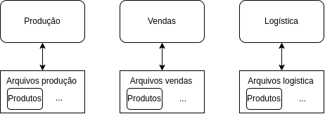
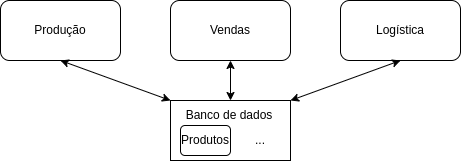
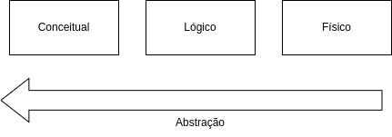
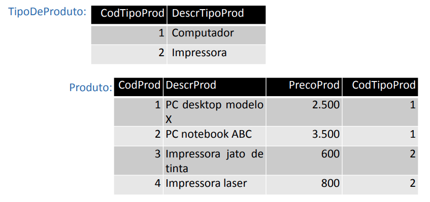
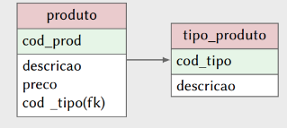
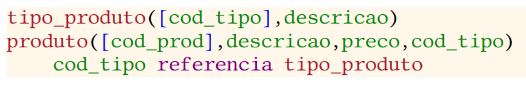

# Onde ficam os dados de um produto em uma empresa?

Imagine o caso de uma empresa com três departamentos distintos e com bancos de dados separados, em sistemas isolados:

Ocorre redundância de dados.

**Fonte:** Adaptado de HEUSER, Carlos Alberto. *Projetos de banco de dados*. 6.ed. Porto Alegre, RS: Bookman, 2009.

# Tipos de redundancia de dados:

- redundância controlada: controlada por software
- redundância não controlada: controlada pelo usuário (inconsistência de  dados e repetição da entrada da mesma informação). 

Como evitar a redundância não controlada?

# Banco de dados:

Conjunto de arquivos integrados que atendem a um conjunto de sistemas (HEUSER, 2009)

**Fonte:** Adaptado de HEUSER, Carlos Alberto. *Projetos de banco de dados*. 6.ed. Porto Alegre, RS: Bookman, 2009.

# O que acontece quando se utiliza um banco de dados?

- A estrutura dos arquivos se tornam mais complexas;
- Devem atender às necessidades de diferentes sistemas.

Solução: Utilizar um Sistema de Gerência de Banco de Dados (SGBD)

SGBD: software que incorpora as funções de definição, recuperação, e alteração de dados em um banco de dados. (HEUSER, 2009)

# Modelo de dados

Definição formal da estrutura de um banco de dados.

É o objetivo de nossa disciplina

Como são armazenado as informações sobre os produtos e suas caracteristicas e não quais produtos estão armazenados no BD.

Podem ser apresentados de várias formas (texto, diagrama...). 

Esquema de banco de dados: forma de apresentação de um modelo de dados.

# Niveis de modelos de banco de dados

**Fonte:** Adaptado de HEUSER, Carlos Alberto. *Projetos de banco de dados*. 6.ed. Porto Alegre, RS: Bookman, 2009.

# Modelo conceitual

Como a estrutura de dados pode aparecer no BD. Não apresenta como os dados estão armazenados no SGBD (independem do tipo de SGBD)

- Abordagem entidade-relacionamento (ER) - Técnica de modelagem conceitual
- Diagrama entidade-relacionamento (DER) - esquema diagramático.

**Fonte:** HEUSER, Carlos Alberto. *Projetos de banco de dados*. 6.ed. Porto Alegre, RS: Bookman, 2009.

# Modelo Lógico

Representa a estrutura de dados de um banco de dados conforme vista pelo usuário do SGBD (HEUSER, 2009).

Banco de dados relacional

**Fonte:** HEUSER, Carlos Alberto. *Projetos de banco de dados*. 6.ed. Porto Alegre, RS: Bookman, 2009.

# Esquema diagramático

**Fonte:** HEUSER, Carlos Alberto. *Projetos de banco de dados*. 6.ed. Porto Alegre, RS: Bookman, 2009.

# Esquema textual

**Fonte:** HEUSER, Carlos Alberto. *Projetos de banco de dados*. 6.ed. Porto Alegre, RS: Bookman, 2009.

# Modelo Físico

- Informações sobre o armazenamento interno das informações
- influencia o desempenho das aplicações (não sobre a programação de aplicações no SGBD)

# Projeto de banco de dados.

Atraves da identificação das entidades que terão informações representadas no banco de dados é possivel identificar os arquivos que irão compor o banco de dados.

**Modelo da organização:** Define as entidades da organização que possuem informações no BD
**Modelos do banco de dados:** define os arquivos (tabelas) que farão parte do BD

# Projeto de um BD

1. Modelagem conceitual
2. Projeto lógico 

Caso ja exista, nescessário executar engenharia reversa.

# Referência Bibliográfica

**HEUSER, Carlos Alberto.** *Projetos de banco de dados*. 6.ed. Porto Alegre, RS: Bookman, 2009. Disponível em: https://biblioteca.sophia.com.br/9198/index.asp?codigo_sophia=844036.