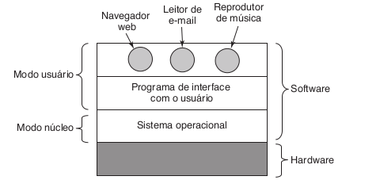

<section> Objetivo do curso:

Fundamentos de Sistemas Operacionais; 

Estruturas de Computadores e de Sistemas Operacionais; 

Gerenciamento de Processos; Escalonamento de Processador; Sincronização de Processos Concorrentes; Deadlocks; 

Gerenciamento de Memória; Memória Virtual; 
</section>
<section>

Sistema de Arquivos; Sistema de Entrada e Saída; Armazenamento Secundário; 

Estudo da Estrutura de Sistemas Operacionais Existentes.

</section>

<section>
Sistema Computacional:

Fonte imagem: TANENBAUM, Andrew S. Sistemas operacionais modernos.

</section>

<section>

O programa pelo qual os usuários interagem pode ser pelo shell (TUI) ou interface gráfica (GUI)

 </section> 

 <section>

Os tipos de softwares podem ser o modo núcleo e modo usuário. SO opera no modo núcleo (supervisor) - Possui acesso a todo hardware.

Modo usuário possui apenas um pequeno conjunto das intruções da máquina. Geralmente não podem executar instruções de E/S (entrada/saida)
 </section> 

<section>
  O que é um sistema operacional?
  
  Conjunto de programas que gerenciam (gerenciador de recursos) os recursos de um computador ou dispositivo eletrônico e facilitam a interação (máquina extendida) entre o hardware e os aplicativos ou o usuário. Ele funciona como uma camada intermediária entre o usuário e o hardware, garantindo que os diferentes componentes do sistema trabalhem de forma coordenada.
</section>

<section>
  <section>
    **Principais funções**
  </section>
  
  <section>
    **Gerenciamento de processos:** Controla a execução de programas, gerenciando múltiplos processos e garantindo que eles utilizem os recursos de forma eficiente.
    
    **Gerenciamento de memória:** Organiza a memória RAM e a memória de armazenamento, alocando espaço para programas em execução e otimizando o uso da memória.
  </section>
</section>
<section>
   **Gerenciamento de dispositivos:** Controla a comunicação com dispositivos periféricos, como teclados, mouses, impressoras e outros componentes externos.
   
    **Gerenciamento de arquivos:** Organiza, armazena e controla o acesso a arquivos e pastas no sistema, garantindo que as informações sejam facilmente acessíveis e seguras.
    
    
</section>
  
<section>
   **Interface com o usuário:** Fornece uma interface gráfica ou de linha de comando para que o usuário interaja com o sistema, executando comandos e acessando recursos.
   
    *Exemplos de sistemas operacionais* incluem Windows, macOS, Linux, Android, e iOS. 
</section>

# Historia dos computadores
* 1945-1955: Primeira geração: Válvulas, painéis de programação
* 1955-1955: Segunda geração: transistores, sistemas em lote
* 1965-1980: Terceira geração: CIs e multiprogramação
* 1980-presente: Quarta geração: computadores pessoais
* 1990-presente: Quinta Geração: computadores móveis

# Tipos de SOs
* SO para computadores de grande porte
* SO de Servidores
* SO de multiprocessadores
* SO de computadores pessoais
* SO de tempo real
* SO embarcado
* SO de cartões inteligentes
