<section> Objetivo do curso:

Fundamentos de Sistemas Operacionais; 

Estruturas de Computadores e de Sistemas Operacionais; 

Gerenciamento de Processos; Escalonamento de Processador; Sincronização de Processos Concorrentes; Deadlocks; 

Gerenciamento de Memória; Memória Virtual; 
</section>
<section>

Sistema de Arquivos; Sistema de Entrada e Saída; Armazenamento Secundário; 

Estudo da Estrutura de Sistemas Operacionais Existentes.

</section>

<section>
Sistema Computacional:

**Fonte:** TANENBAUM, Andrew S. *Sistemas operacionais modernos*. São Paulo, SP: Pearson, 2015. Disponível em: https://biblioteca.sophia.com.br/9198/index.asp?codigo_sophia=809213. Acesso em: 2 fev. 2025.
</section>

<section>

O programa pelo qual os usuários interagem pode ser pelo shell (TUI) ou interface gráfica (GUI).

(TANENBAUM, 2015)

</section> 

<section>

Os tipos de softwares podem ser o modo núcleo e modo usuário. O SO opera no modo núcleo (supervisor) - Possui acesso a todo hardware.

Modo usuário possui apenas um pequeno conjunto das instruções da máquina. Geralmente não podem executar instruções de E/S (entrada/saída).

(TANENBAUM, 2015)

</section>

<section>
  O que é um sistema operacional?
  
  Conjunto de programas que gerenciam (gerenciador de recursos) os recursos de um computador ou dispositivo eletrônico e facilitam a interação (máquina extendida) entre o hardware e os aplicativos ou o usuário. Ele funciona como uma camada intermediária entre o usuário e o hardware, garantindo que os diferentes componentes do sistema trabalhem de forma coordenada.

(TANENBAUM, 2015)

</section>

<section>
  <section>
    **Principais funções**
  </section>
  
  <section>
    **Gerenciamento de processos:** Controla a execução de programas, gerenciando múltiplos processos e garantindo que eles utilizem os recursos de forma eficiente.
    
    **Gerenciamento de memória:** Organiza a memória RAM e a memória de armazenamento, alocando espaço para programas em execução e otimizando o uso da memória.

(TANENBAUM, 2015)

  </section>
</section>

<section>
   **Gerenciamento de dispositivos:** Controla a comunicação com dispositivos periféricos, como teclados, mouses, impressoras e outros componentes externos.
   
    **Gerenciamento de arquivos:** Organiza, armazena e controla o acesso a arquivos e pastas no sistema, garantindo que as informações sejam facilmente acessíveis e seguras.

(TANENBAUM, 2015)

</section>
  
<section>
   **Interface com o usuário:** Fornece uma interface gráfica ou de linha de comando para que o usuário interaja com o sistema, executando comandos e acessando recursos.
   
    *Exemplos de sistemas operacionais* incluem Windows, macOS, Linux, Android, e iOS.

(TANENBAUM, 2015)

</section>

# História dos computadores

* 1945-1955: Geração 1: Válvulas, painéis de programação
* 1955-1965: Geração 2: transistores, sistemas em lote
* 1965-1980: Geração 3: CIs e multiprogramação
* 1980-presente: Geração 4: computadores pessoais
* 1990-presente: Geração 5: computadores móveis

(TANENBAUM, 2015)

# Tipos de SOs

* SOs para computadores de grande porte
* SOs de Servidores
* SOs de multiprocessadores
* SOs de computadores pessoais
* SOs de tempo real
* SOs embarcado
* SOs de cartões inteligentes

(TANENBAUM, 2015)

# Hardware:

**Fonte:** TANENBAUM, Andrew S. *Sistemas operacionais modernos*. São Paulo, SP: Pearson, 2015. Disponível em: https://biblioteca.sophia.com.br/9198/index.asp?codigo_sophia=809213. Acesso em: 2 fev. 2025.

# Pipeline execução CPU:

**Fonte:** TANENBAUM, Andrew S. *Sistemas operacionais modernos*. São Paulo, SP: Pearson, 2015. Disponível em: https://biblioteca.sophia.com.br/9198/index.asp?codigo_sophia=809213. Acesso em: 2 fev. 2025.

# Multithreading e Multicore:

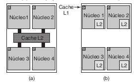

**Fonte:** TANENBAUM, Andrew S. *Sistemas operacionais modernos*. São Paulo, SP: Pearson, 2015. Disponível em: https://biblioteca.sophia.com.br/9198/index.asp?codigo_sophia=809213. Acesso em: 2 fev. 2025.

# Memória:

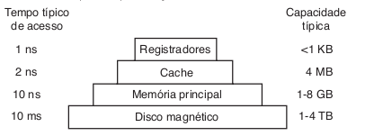

**Fonte:** TANENBAUM, Andrew S. *Sistemas operacionais modernos*. São Paulo, SP: Pearson, 2015. Disponível em: https://biblioteca.sophia.com.br/9198/index.asp?codigo_sophia=809213. Acesso em: 2 fev. 2025.

# E/S:

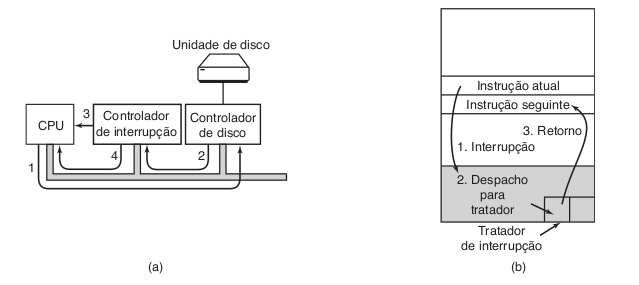

**Fonte:** TANENBAUM, Andrew S. *Sistemas operacionais modernos*. São Paulo, SP: Pearson, 2015. Disponível em: https://biblioteca.sophia.com.br/9198/index.asp?codigo_sophia=809213. Acesso em: 2 fev. 2025.

# Barramentos:

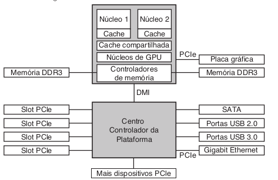

**Fonte:** TANENBAUM, Andrew S. *Sistemas operacionais modernos*. São Paulo, SP: Pearson, 2015. Disponível em: https://biblioteca.sophia.com.br/9198/index.asp?codigo_sophia=809213. Acesso em: 2 fev. 2025.

# Processos:

Processos são programas em execução.

Associado a cada processo existe um espaço de endereçamento.

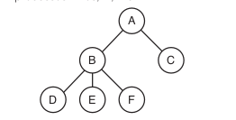

**Fonte:** TANENBAUM, Andrew S. *Sistemas operacionais modernos*. São Paulo, SP: Pearson, 2015. Disponível em: https://biblioteca.sophia.com.br/9198/index.asp?codigo_sophia=809213. Acesso em: 2 fev. 2025.

# Arquivos:

Diretório: maneira de agrupar os arquivos (hierarquia).

Nome do caminho: ~/Documentos/Git/PaginaWEB - ProfLgrando/proflgrando.github.io

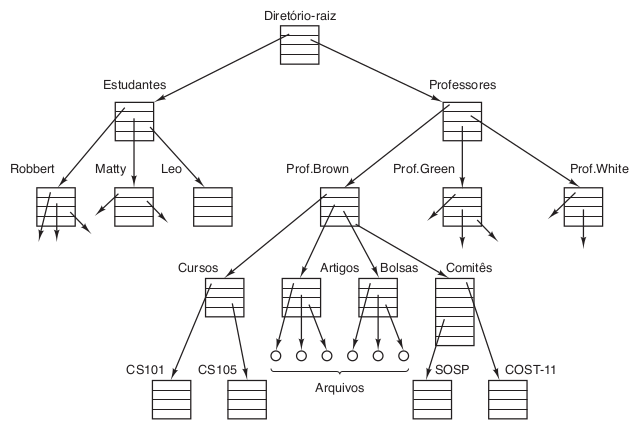

**Fonte:** TANENBAUM, Andrew S. *Sistemas operacionais modernos*. São Paulo, SP: Pearson, 2015. Disponível em: https://biblioteca.sophia.com.br/9198/index.asp?codigo_sophia=809213. Acesso em: 2 fev. 2025.

# 

No UNIX ocorre a montagem do sistema de arquivos (DVDs, memória de dispositivos USB etc).

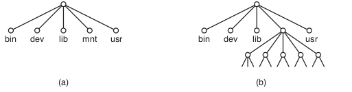

**Fonte:** TANENBAUM, Andrew S. *Sistemas operacionais modernos*. São Paulo, SP: Pearson, 2015. Disponível em: https://biblioteca.sophia.com.br/9198/index.asp?codigo_sophia=809213. Acesso em: 2 fev. 2025.

# Pipe:

Pseudoarquivo que pode ser usado para conectar dois processos.

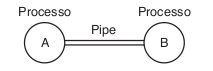

**Fonte:** TANENBAUM, Andrew S. *Sistemas operacionais modernos*. São Paulo, SP: Pearson, 2015. Disponível em: https://biblioteca.sophia.com.br/9198/index.asp?codigo_sophia=809213. Acesso em: 2 fev. 2025.

# Chamada de Sistema:

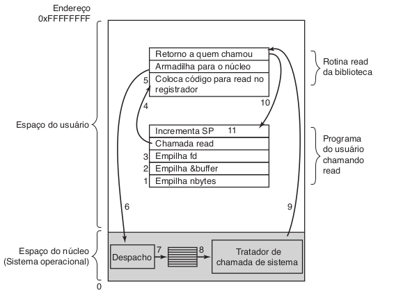

**Fonte:** TANENBAUM, Andrew S. *Sistemas operacionais modernos*. São Paulo, SP: Pearson, 2015. Disponível em: https://biblioteca.sophia.com.br/9198/index.asp?codigo_sophia=809213. Acesso em: 2 fev. 2025.

# Gerenciamento de Diretórios e Arquivos

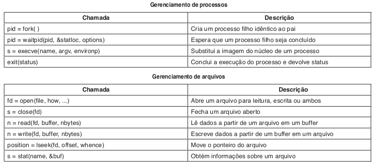

**Fonte:** TANENBAUM, Andrew S. *Sistemas operacionais modernos*. São Paulo, SP: Pearson, 2015. Disponível em: https://biblioteca.sophia.com.br/9198/index.asp?codigo_sophia=809213. Acesso em: 2 fev. 2025.

# 

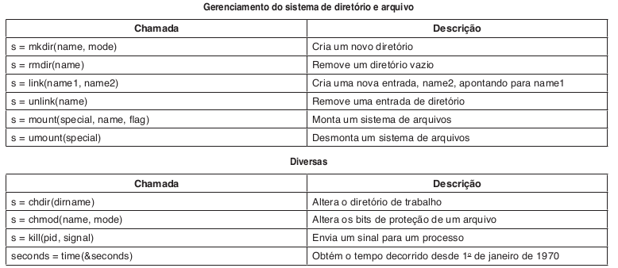

**Fonte:** TANENBAUM, Andrew S. *Sistemas operacionais modernos*. São Paulo, SP: Pearson, 2015. Disponível em: https://biblioteca.sophia.com.br/9198/index.asp?codigo_sophia=809213. Acesso em: 2 fev. 2025.

# Segmentos de um Processo

- Cada processo é composto por três segmentos: **Texto**, **Dados** e **Pilha**.

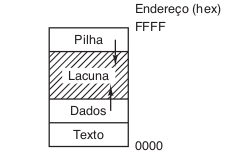

**Fonte:** TANENBAUM, Andrew S. *Sistemas operacionais modernos*. São Paulo, SP: Pearson, 2015. Disponível em: https://biblioteca.sophia.com.br/9198/index.asp?codigo_sophia=809213. Acesso em: 2 fev. 2025.

# Chamadas de Gerenciamento de Diretórios

- **Antes e após a ligação** de diretórios no sistema.

**Fonte:** TANENBAUM, Andrew S. *Sistemas operacionais modernos*. São Paulo, SP: Pearson, 2015. Disponível em: https://biblioteca.sophia.com.br/9198/index.asp?codigo_sophia=809213. Acesso em: 2 fev. 2025.

# Chamadas à API Win32

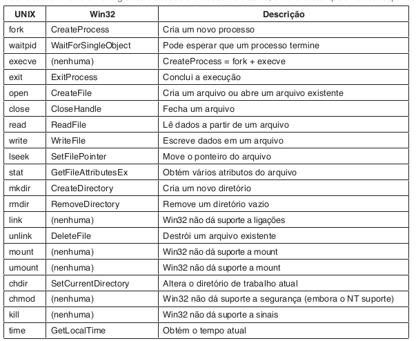

**Fonte:** TANENBAUM, Andrew S. *Sistemas operacionais modernos*. São Paulo, SP: Pearson, 2015. Disponível em: https://biblioteca.sophia.com.br/9198/index.asp?codigo_sophia=809213. Acesso em: 2 fev. 2025.

# Estruturas de SO

1. **Sistemas Monolíticos**: O código do núcleo é implementado em um único bloco, sem separação clara entre as partes.
2. **Sistemas de Camadas**: O SO é organizado em camadas, cada uma responsável por uma função específica.
3. **Micronúcleos**: Núcleos mínimos que delegam a maior parte das funções a processos no espaço de usuário.
4. **Sistemas Clientes-Servidor**: Sistema dividido entre clientes que solicitam serviços e servidores que os fornecem.
5. **Máquinas Virtuais**: Permitem a execução de sistemas operacionais independentes sobre um único hardware físico.
6. **Exonúcleos**: A gestão de recursos é movida para o espaço de usuário, oferecendo maior modularidade e flexibilidade.

# Sistema Monolítico

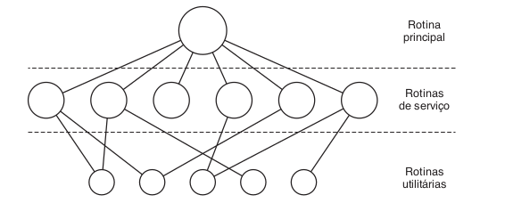

**Fonte:** TANENBAUM, Andrew S. *Sistemas operacionais modernos*. São Paulo, SP: Pearson, 2015. Disponível em: https://biblioteca.sophia.com.br/9198/index.asp?codigo_sophia=809213. Acesso em: 2 fev. 2025.

**Explicação:** No sistema monolítico, todo o código do sistema operacional é combinado em um único bloco, o que pode dificultar a manutenção e atualização do sistema.

# Sistema de Camadas

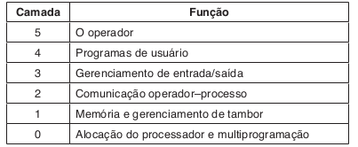

**Fonte:** TANENBAUM, Andrew S. *Sistemas operacionais modernos*. São Paulo, SP: Pearson, 2015. Disponível em: https://biblioteca.sophia.com.br/9198/index.asp?codigo_sophia=809213. Acesso em: 2 fev. 2025.

**Explicação:** No modelo em camadas, o sistema operacional é organizado de forma hierárquica, onde cada camada interage apenas com as camadas adjacentes, proporcionando maior modularidade.

# Micronúcleos

**Fonte:** TANENBAUM, Andrew S. *Sistemas operacionais modernos*. São Paulo, SP: Pearson, 2015. Disponível em: https://biblioteca.sophia.com.br/9198/index.asp?codigo_sophia=809213. Acesso em: 2 fev. 2025.

**Explicação:** Os micronúcleos oferecem um núcleo minimalista e delegam muitas funções para processos no espaço de usuário, aumentando a flexibilidade e a segurança do sistema.

# Modelo Cliente-Servidor

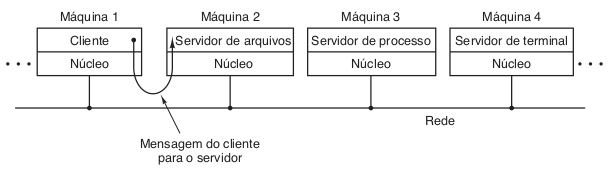

**Fonte:** TANENBAUM, Andrew S. *Sistemas operacionais modernos*. São Paulo, SP: Pearson, 2015. Disponível em: https://biblioteca.sophia.com.br/9198/index.asp?codigo_sophia=809213. Acesso em: 2 fev. 2025.

**Explicação:** O modelo cliente-servidor divide o sistema em partes que solicitam e fornecem serviços, promovendo a comunicação e a distribuição de recursos de forma eficiente.

# Máquinas Virtuais

As máquinas virtuais permitem que múltiplos sistemas operacionais rodem sobre um único hardware físico, isolando-os uns dos outros para garantir segurança e independência.

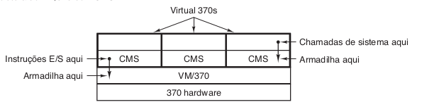

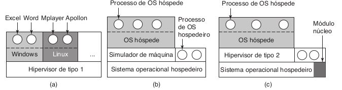

**Fonte:** TANENBAUM, Andrew S. *Sistemas operacionais modernos*. São Paulo, SP: Pearson, 2015. Disponível em: https://biblioteca.sophia.com.br/9198/index.asp?codigo_sophia=809213. Acesso em: 2 fev. 2025.

**Explicação:** O conceito de máquinas virtuais foi expandido com o uso de hypervisores, que permitem a criação e o gerenciamento de diversas máquinas virtuais em um único sistema físico.

# Referência Bibliográfica

**TANENBAUM, Andrew S.** *Sistemas operacionais modernos*. São Paulo, SP: Pearson, 2015. Disponível em: https://biblioteca.sophia.com.br/9198/index.asp?codigo_sophia=809213. Acesso em: 2 fev. 2025.
